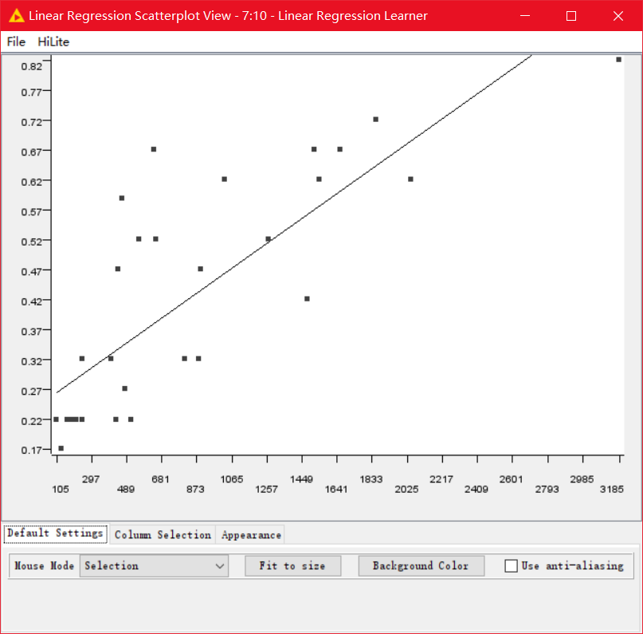
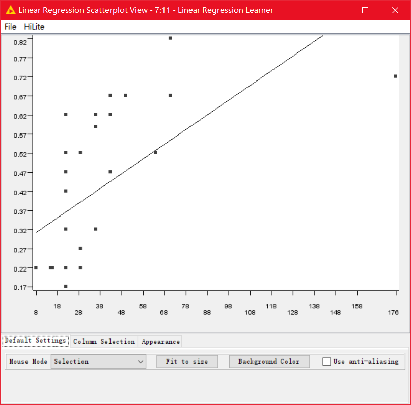
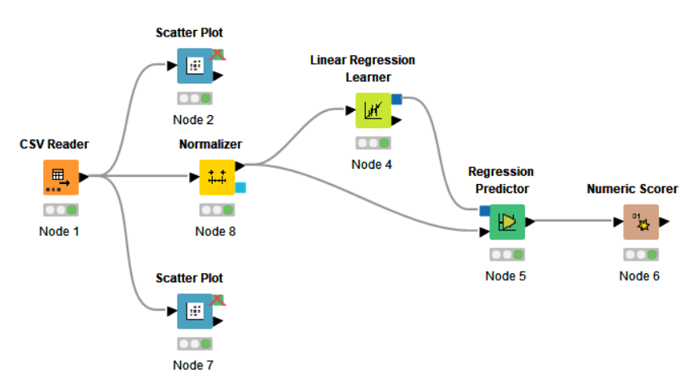
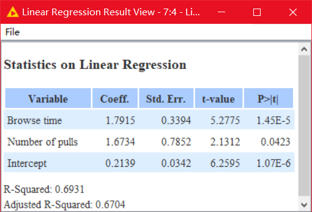

## 网站页面受用户欢迎程度排序

​	用户的浏览行 为主要表现为查询 、浏览页面 、将浏览页面加入收藏 、页面窗口最大化和最小化 、点击鼠标 、拖动滚动条 、标记书签、前进 、后退等等。从表面上看，这些行为都能够反映用户对网页得兴趣，但是深入分析后发现，几乎所有的浏览行为都可以由两种 浏览动作集中体现，用户在网页上的浏览时间和拖动滚动条的次数。因此，下面将基于用户在网页上的浏览时间和拖动滚动条的次数这两种用户行为建立网页评分模型来给网页的受欢迎程度进行排序 。下面以某网站上30个网页的浏览数据为例来建立网页的评分模型 。见**`teat.csv`**中数据。为了能够正确选择模型，需要先知道网页评分与网页浏览时间之间的关系，可以先做出二者之间的散点图，通过对二者样本数据的散点图的观察来确定二者之 间的大致关系 。

首先是网页评分与浏览时间的散点图：

从上图可以看出`<网页评分,网页浏览时间>`样本数据点大致分布在直线`y = 0.0002x + 0.2428`众多参考直线中的一条)这条直线的两侧，从而可以看出网页评分与网页浏览时间存在着线性关系

然后是网页评分与滚动条拉动次数的散点图：

从网页评分与拉动滚动条次数散点图我们可以看出`<网页评分,网页浏览时间>`样本数据点大致分布在直线 `y = 0.0038x + 0.2837` (众多参考直线中的一条)这条直线的两侧 ，可以看出网页评分与网页浏览时间存在着线性关系。进一步分析它们之间线性关系强弱，其中网页评分与浏览时间的相关系数为`0.81 > 0.8 > 0`，说明网页评分与浏览时间呈正相关且为高度相关，而伴随概率`1.06E-7 < 0.05`，因此拒绝零假设，说明网页评分是受网页浏览时间显著性正影响的。网页评分与拉动滚动条次数的相关系数为`0.64 > 0.5 > 0`，说明网页评分与浏览时间呈正相关且为中度相关，伴随概率为`0.0003 < 0.05`，因此拒绝零假设，说明网页评分是也受网页浏览时间显著性正影响的，因此网页评分与拉动滚动条次数和网页浏览时间的具有较强的线性相关，可以采用线性回归来建立评分模型。

​	首先使用`Normalizer`元件使用`Decimal Scaling`小数定点归一化来对数据进行处理，即`标准页面浏览时间 = 页面浏览时间 / 1000`，`标准拉动滚动条次数 = 拉动滚动条次数 / 10`，对应回归方程为*y = b + w1x1 + w2x2*。使用`Linear Regression Learner`元件进行计算。模型文件见**`DateMining01.knwf`**

*b = 0.2139, w1 = 1.7915, w2 = 1.6734*，回归方程为*y = 0.2139 + 1.7915x1 + 1.6374x2*

​	同时使用回归方程计算结果与预计评分的比值作为标准来判断结果的准确性，大多数准确度在`80%-100%`之间，少量在`60%-80%`之间，平均准确率在`83.23%`左右，可以作为网站页面受欢迎程序排序的一个参考结果。通过方程计算结果对网站页面受欢迎程度进行排序，结果见**`res.csv`**。